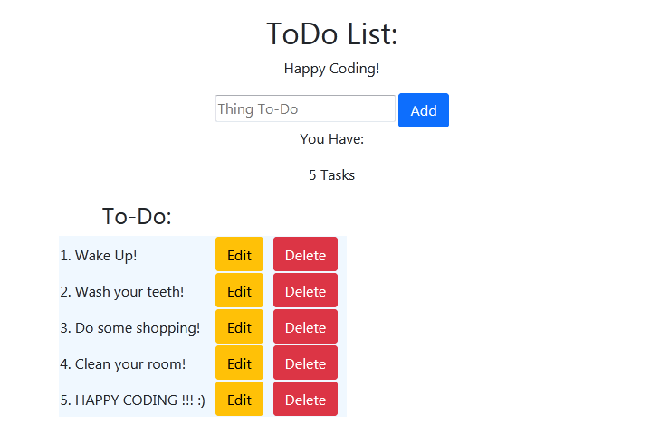

<h1 align="center">
    <strong>Urgent TodoList</strong>
</h1>
<h3 align="center">
    CRUD TodoList written in HTML CSS JS
</h3>

## Features
CRUD operations: CREATE, READ, UPDATE, DELETE

* *Input filed to add todo*
* *Todo counter*
* *List of todos*
* *Todos can be updated and deleted*

action="javascript:void(0);"  - to avoid page reload
